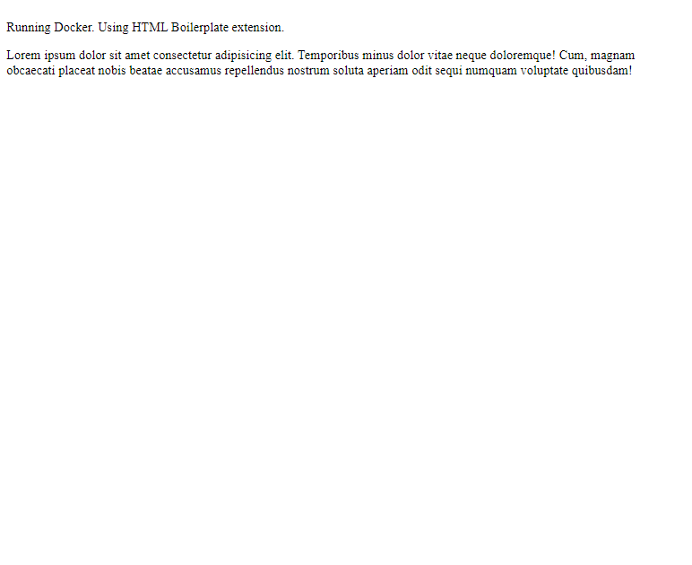
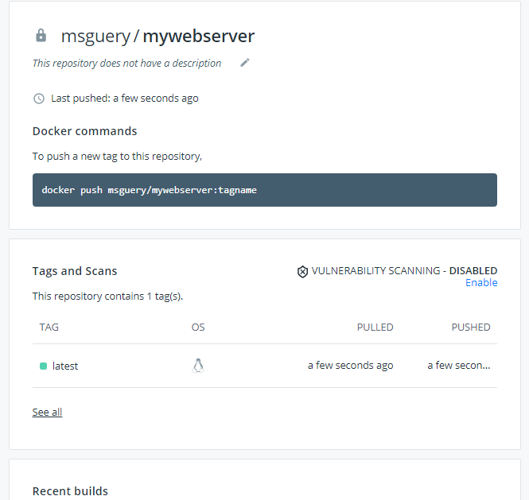

# Docker 

container mgmt software. more resources can be deployed = high availability, less $. pkg software so it can run on any hardware and works on anyones machine. secure. consistent (using templates). Can boot a difft OS, own process space, network interface, install pkgs. VM vs container - VM has a complete OS, container is lightweight and uses the host OS kernel / "Automates the deployment of applications inside software containers, by providing an additional layer of abstraction and automation of operating-system-level virtualization"

"Client-server architecture. client talks to the Docker daemon which does the heavy lifting of building, running, and distributing your Docker containers. The Docker client and daemon can run on the same system, or you can connect a Docker client to a remote Docker daemon. The Docker client and daemon communicate using a REST API, over UNIX sockets or a network interface. Another Docker client is Docker Compose, that lets you work with applications consisting of a set of containers." [docs](https://docs.docker.com/get-started/overview/)

image = "isolated filesystem" blueprint/snapshot of container. read-only template with instructions for creating a Docker ctnr. has all needed to run an app - dependencies, configs, scripts, binaries, env vars, and other metadata. Can be based on another image (from registry) with some extra customizations. 

containers = "another process on your machine that has been isolated from all other processes on the host machine." microcomputers with own OS, mem, ntwk. running instance of the image.

Dockerfile = blueprint for building a docker img. contains code to build this img. 

---

Create a Dockerfile and add steps/layers to run the app. Run `docker build` then `docker run`. 

## Statements

Statement | Purpose | Example
--- | --- | ---
FROM | To specify/set the base image. | `FROM alpine` = `FROM alpine:latest` `FROM httpd:2.4` (image/tag:version)
RUN | To install any applications and packages required for your container. | `RUN apk add python` `RUN mkdir -p /app/src` `RUN npm install`
COPY | To copy over files or directories from a specific location. | `COPY . /usr/local/apache2/htdocs/` `COPY package.json .` ('.' = working dir) `COPY . .` (source / destination)
ADD | As COPY, but also able to handle remote URLs and unpack compressed files. | `ADD webserver.tar.gz /var/www/html/` (source / dest)
ENTRYPOINT | Command that will always be executed when the container starts. If not specified, the default is /bin/sh -c | `ENTRYPOINT [ "ping", "-t", "5" ]`
CMD | Arguments passed to the entrypoint. If ENTRYPOINT is not set (defaults to /bin/sh -c), the CMD will be the commands the container executes. | `CMD ["8.8.8.8"]` `CMD ["npm", "start"]`
EXPOSE | To define which port through which to access your container application. | `EXPOSE 80` (exposes port 80 to view in browser) / cmd: -p or -P if EXPOSE in dockerfile
WORKDIR  | To set the working directory for any commands that follow in the Dockerfile. New dir created if doesn't exist | `WORKDIR /app/src`
VOLUME | | `VOLUME ["/data"]` (puts /data -> /var/lib/docker/volumes/)
LABEL | To add metadata to the image.

[table from Jfrog](https://jfrog.com/knowledge-base/a-beginners-guide-to-understanding-and-building-docker-images/), plus my examples

- **RUN** - only executes when building/running the img
- **CMD** and **ENTRYPOINT** - CMD can be overridden / ENTRYPOINT sets the main process / both execute when start/run container
- **ADD** - COPY vs ADD - same but ADD supports remote URLs and uncompressing tar files, and copies content to the destination

---

## Commands

Command | Purpose | Example
--- | --- | ---
docker --version | gets the current version of docker | 
docker info | detailed information about docker installed on the system including the kernel version, number of containers and images | 
docker images | list all the docker images  | 
docker run | runs command in a new container | `docker run -it -d httpd`
docker build | build an image from a Dockerfile | `docker build . -t image:version`
docker push | push (upload) an image or a repository to a registry | `docker push msguery/imagename:latest`
docker pull | pull an image or a repository from a registry | `docker pull msguery/imagename:latest`
docker ps | lists all the docker containers are running with container details | `docker ps -a` lists all containers running, exited, and stopped
docker exec | this command is used to access the running container | `docker exec -it 09ca6feb6efc bash`
docker rm | deletes the docker container with container id mentioned | `docker rm 9b6343d3b5a0`
docker rmi | deletes the docker image with the docker image id mentioned | `docker rmi fce289e99eb9`
docker start or restart | start or restart the docker container with container id mentioned | `docker start 09ca6feb6efc` `docker restart 09ca6feb6efc`
docker stop | stop a container with container id mentioned  | `docker stop 09ca6feb6efc`
docker kill | stops the docker container immediately | `docker kill 09ca6feb6efc`
docker login / logout | login/out to Docker Hub | `docker login` `docker login -u msguery` `docker logout`
docker tag | creates a tag | `docker tag 09ca6feb6efc msguery/imagename:latest`
docker rename | rename a container | 
docker cp | copies a file from a docker container to the local system | `docker cp 09ca6feb6efc:/usr/local/apache2/logs/httpd.pid /home/msguery/` (source destination)
docker network | lists the details of all the network in the cluster | `docker network ls`
docker volume |	manage volumes |
docker history | history of a docker image with the image name mentioned | `docker history httpd`
docker logs | shows logs of the docker container with contained id mentioned |  `docker logs 09ca6feb6efc`
docker top |	display the running processes of a container |
docker volume | create a volume which docker container will use to store data | `docker volume create` `docker volume ls`
docker import / export | import the contents from a tarball to create a filesystem image or export a container’s filesystem as a tar archive |  `docker import` `docker export`
docker update	| update configuration of one or more containers |

---

1. Remember to start Docker Desktop!
2. Open terminal
3. `mkdir foldername && cd foldername`
4. `touch Dockerfile`

In Dockerfile
```Dockerfile
FROM nginx:latest

CMD echo "hello world"
```

In the terminal
1. `docker build . -t myfirstimg:1`
2. `docker run myfirstimg:1`

---

# Projects + notes

- COPY - [folder](https://github.com/mguery/docker/tree/main/copy)



- Create 'mydockerfile'. In cmd `docker build --file="mydockerfile" . -t`
- Build from remote URL - `docker build https://github.com/madflojo/automatron.git -t automatron:1`

**syntax** - 'docker image' 'docker container'
  - 'docker image rm 68a96ddb4d81' ("68a96ddb4d81" is a container ID) - deletes layer / 'docker image rm nginx' / 'docker image rm $(docker image ls -aq)' a=attrib q=docker img id 
- **stop containers** - 'docker container ls' to view ctrs then 'docker container stop 31' (first 2 characters of container id) / 'docker container prune' - removes all stopped containers 
- **name containers** - 'docker container run -d -p --name=mywebserv httpd:2..4' -d = detached, -p = your web server / 'docker container stop mywebserv' - stops container
- **Volume Mounts** - takes folder on local machine or server and attach to a container. Get full pwd (pwd in cmd) `docker container run -p 8080:80 -v /Users/Marjy/Documents/Docker/website:/usr/local/apache2/htdocs httpd:2.4` source is your dir path, destination is apache / [docs](https://docs.docker.com/storage/bind-mounts/#choose-the--v-or---mount-flag) / encouraged to use --mount instead of -v, because research has shown it to be easier to use. / But -v creates the endpoint for you. It is always created as a directory. And --mount  does not automatically create it for you, but generates an error.
- **Image tagging** - `docker tag myweb:1 mywebserver:latest` - renames tag to mywebserver:latest / [docs](https://docs.docker.com/engine/reference/commandline/tag/) 
- **EXEC** - Access a container / Run a Linux command in a running container / `docker run -d -p 8080:80 httpd:2.4`, run docker container ls and get the container ID `docker container exec -it containerID /bin/bash` i = interactive mode, t = terminal / can run cmds `echo "Hello from inside container" > index.html`, then exit  / [docs](https://docs.docker.com/engine/reference/commandline/exec/)
- **Docker repos** - instead of local, use Docker Hub or AWS ECR. "share container images with your team, customers, or the Docker community at large." / In Dockerfile `FROM httpd:2.4 EXPOSE 80`, [login](https://hub.docker.com/repositories) to create repo. msguery = server name, mywebserver = repo name, then retag image / `docker login` - authenticates credentials / `docker tag port:1 msguery/mywebserver:latest` / `docker image push msguery/webserver:latest`



If public, `docker image pull servername/reponame:latest` to pull image

---

# Docker Compose

Used to run multiple Docker Containers as a single server. Create Dockerfile then YAML file (docker-compose.yml). [Get started guide](https://docs.docker.com/compose/gettingstarted/) / [Docs](https://docs.docker.com/compose/) / [WordPress example](https://docs.docker.com/compose/wordpress/). Services - 2 defined below - db, wp

```yaml
version: "3.9"
    
services:
  db:
    image: mysql:5.7
    volumes:
      - db_data:/var/lib/mysql
    restart: always
    environment:
      MYSQL_ROOT_PASSWORD: somewordpress
      MYSQL_DATABASE: wordpress
      MYSQL_USER: wordpress
      MYSQL_PASSWORD: wordpress
    
  wordpress:
    depends_on:
      - db
    image: wordpress:latest
    ports:
      - "8000:80"
    restart: always
    environment:
      WORDPRESS_DB_HOST: db:3306
      WORDPRESS_DB_USER: wordpress
      WORDPRESS_DB_PASSWORD: wordpress
      WORDPRESS_DB_NAME: wordpress
    volumes:
      - .wp-content:/var/www/html/
volumes:
  db_data: {}
```

In terminal - `docker-compose up -d` (-d = detached mode, runs as bg task, can use terminal), `docker compose down` - stops ctnr

Can use Docker extension in VSC instead of cli. RIght click for more options, 'Open in browser'.

---

# Advanced

- **Layers** - "Layers of a Docker image are essentially just files generated from running some command. You can view the contents of each layer on the Docker host at /var/lib/docker/aufs/diff. Layers are neat because they can be re-used by multiple images saving disk space and reducing time to build images while maintaining their integrity." [quote from](https://medium.com/@jessgreb01/digging-into-docker-layers-c22f948ed612) / Below shows the commands that are executed to create a node.js web app image. (AUFS = another union filesystem)

```Dockerfile
FROM node:argon
# Create app directory
RUN mkdir -p /usr/src/app
WORKDIR /usr/src/app
# Install app dependencies
COPY package.json /usr/src/app/
RUN npm install
# Bundle app source
COPY . /usr/src/app
EXPOSE 8080
CMD [ "npm", "start" ]
```

"When Docker builds the container from the above Dockerfile, each step corresponds to a command run in the Dockerfile. And each layer is made up of the file generated from running that command. Along with each step, the layer created is listed represented by its random generated ID (Ex below - '530c750a346e')."

```console
$ docker build -t expressweb .
Step 1 : FROM node:argon
argon: Pulling from library/node......
Status: Downloaded newer image for node:argon ---> 530c750a346e
```
"you can view all the layers that make up the image with the docker history command. The “Image” column (i.e intermediate image or layer) shows the randomly generated UUID that correlates to that layer."
```console
$ docker history expressweb
IMAGE         CREATED    CREATED BY                       SIZE      
fdd93d9c2c60  2 days ago /bin/sh -c CMD ["npm" "start"]   0 B
e9539311a23e  2 days ago /bin/sh -c EXPOSE 8080/tcp       0 B
995a21532fce  2 days ago /bin/sh -c COPY dir:50ab47bff7   760 B
```

"An image becomes a container when the docker run command is executed." - `docker run expressweb`
"To dig down into each layer of the image and view its contents you need to view the layers on the Docker host at: `/var/lib/docker/aufs`"
**Reducing layers** - Every single RUN instruction creates a new layer. Put all install statement on a single line remove run statements (except first one)  then append `&& \` / `docker image build . -t layers:2`

```Dockerfile
FROM ubuntu:16.04
RUN apt-get update && \
apt install curl -y && \
apt install ruby -y && \
apt install python -y && \
apt install build-essential -y && \
apt install apache2 -y 
```

- **EXPORT and IMPORT** 
[from 'Flatten a Docker container'](https://tuhrig.de/flatten-a-docker-container-or-image) 
A Docker image can be saved to a tarball and loaded back again. This will preserve the history of the image.

```
# save the image to a tarball
docker save <IMAGE NAME> > /home/save.tar
 
# load it back
docker load < /home/save.tar
```

A Docker container can be exported to a tarball and imported back again. This will not preserve the history of the container.

```
# export the container to a tarball
docker export <CONTAINER ID> > ./export.tar
 
# import it back
cat export.tar | docker import - some-name:latest
```

So it is only possible to “flatten” a Docker container, not an image. So we need to start a container from an image first. Then we can export and import the container in one line:

`docker export <CONTAINER ID> | docker import - some-image-name:latest`
`apt-get clean` - to clear cache

- **Reducing Docker Image Size** - Use Alpine as a base image - 5 mb. [Packages available with Alpine](https://pkgs.alpinelinux.org/packages?name=ruby&branch=edge). From Dockerfile:
```Dockerfile
FROM alpine
RUN apk update update && \
apk add curl && \
apk add ruby && \
apk add python && \
apk add build-base && \
apk add apache2 
```

- **Multistage Image** - Split image by using multiple FROM statements. / [Docker docs about MI](https://docs.docker.com/develop/develop-images/multistage-build/) / [GH - Docker Multistage example](https://github.com/katherinelim/docker-multistage-example)

Inside Dockerfile:
```Dockerfile
FROM openjdk:9-jdk-slim AS build
COPY certificates /usr/local/share/ca-certificates/certificates
RUN apt-get update && apt-get install --no-install-recommends -y -qq ca-certificates-java && \
  update-ca-certificates --verbose

FROM openjdk:9-jre-slim
COPY --from=build /etc/ssl/certs/java/cacerts /etc/ssl/certs/java/cacerts
RUN groupadd --gid 1000 java && \
  useradd --uid 1000 --gid java --shell /bin/bash --create-home java && \
  chmod -R a+w /home/java
WORKDIR /home/java
USER java
```
Then run docker build

(TL;DR - how can you reduce an img size? - multistage image, reduce number of instructions, export and import)

---
**Docker vs Kubernetes**

Use Docker as a container runtime env, Kubernetes platform to deploy images.

Resources

- [Containers](https://github.com/bregman-arie/devops-exercises#containers)
